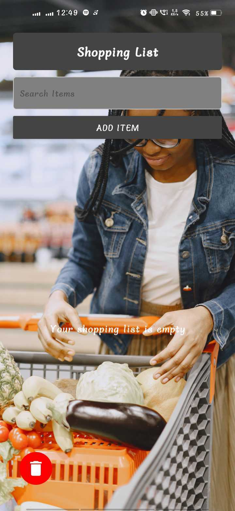
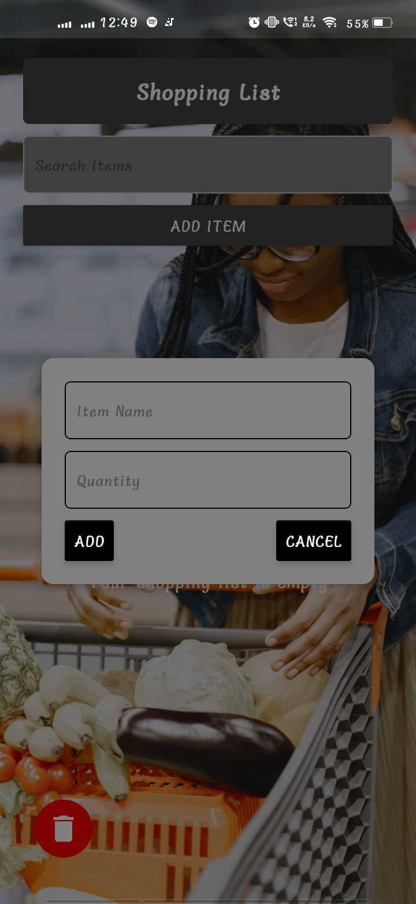

# Expo Shopping List


Expo Shopping List is a React Native application designed to help users manage their shopping lists efficiently. The app allows users to add, edit, delete, and search for items in their shopping list. It utilizes Redux for state management and Expo for a smooth development experience.

## Screenshots

<div style="display: flex; justify-content: space-between; margin-bottom: 20px;">
    
    
    
</div>

## Features

- **Add Items**: Users can add items to their shopping list with a name and quantity.
- **Edit Items**: Users can edit existing items in the list.
- **Delete Items**: Users can remove items from their shopping list.
- **Search Functionality**: Users can search for items in the list.
- **Persistent Storage**: The app uses AsyncStorage to persist the shopping list data.
- **Responsive Design**: The app is designed to work on both iOS and Android devices.

## Technologies Used

- **React Native**: For building the mobile application.
- **Redux**: For state management.
- **Expo**: For a streamlined development process.
- **React Navigation**: For navigating between different screens.
- **React Native Vector Icons**: For using icons in the app.
- **AsyncStorage**: For persisting data locally.

## Installation

To get started with the project, follow these steps:

1. **Clone the repository**:
   ```bash
   git clone https://github.com/J3ZZ3/Expo_Shopping_List.git
   cd Expo_Shopping_List
   ```

2. **Install dependencies**:
   ```bash
   npm install
   ```

3. **Run the app**:
   ```bash
   npm start
   ```

   This will start the Expo development server. You can then scan the QR code with the Expo Go app on your mobile device or run it in an emulator.

## Usage

- Open the app and you will see the shopping list interface.
- Use the "Add Item" button to add new items.
- You can edit or delete items by pressing the corresponding buttons next to each item.
- Use the search bar to filter items in the list.


